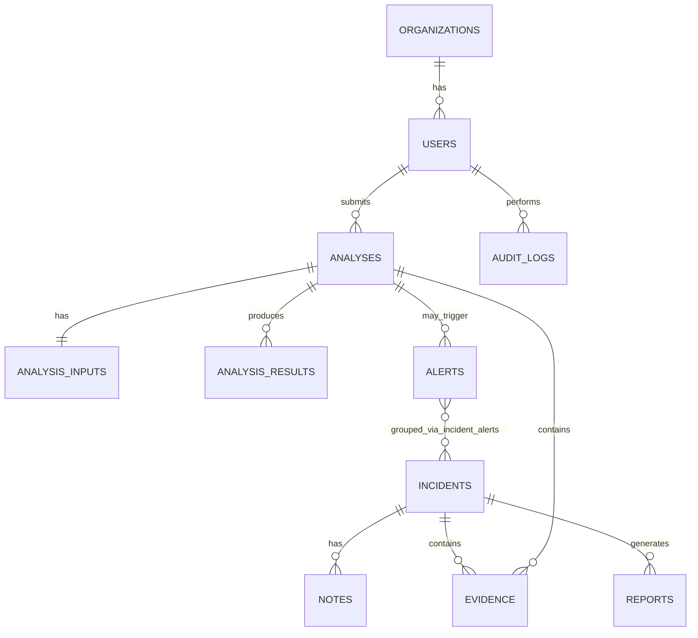

# CYBER PLATFORM — FINAL MASTER REPORT
### Single Source of Truth for Implementation (Hackathon: 19–20 Sept 2026, problem revealed 19 Sept)

This document supersedes the earlier blueprint. Every decision below is final. No alternatives are offered where a decision is stated.

---

## SECTION 1 — EXECUTIVE DECISION

**What we are building:** A reusable, secure, full-stack SOC/SIEM-style platform with a **Stable Core** (identity, analysis orchestration, alerts, incidents, evidence, audit, reporting, dashboard) and a set of well-defined **extension points** where problem-specific intelligence (analyzers, models, rules, indicators, UI panels) plugs in after 19 Sept.

**Why this is reusable — precisely stated claim:** The core does not require rewriting for any threat class in scope (phishing, malware, deepfakes, fraud, network intrusion, insider threat, etc.). The core **will require extension** — new analyzer classes, new rule packs, new risk policies, new indicator types, occasionally a new UI panel or workflow state. This is **Stable Core + Extensible Modules**, not a zero-change claim.

**What we will NOT build before Sept 19:** any real detection model, any problem-specific feature extraction, any problem-specific dataset, any problem-specific UI screen, Kubernetes, a second backend service, GraphQL, SSO, billing, a custom design system, a real threat-intel subscription integration beyond one proof-of-pattern adapter.

**Final technology stack (locked, detailed in Section 2).**

**Core architectural principle:** *Every analysis of every kind flows through one pipeline — validate → queue → resolve analyzer → preprocess → score (rules + model + intel, weighted by a per-analyzer policy) → persist → alert → notify.* Nothing about that pipeline changes across problem types; only the analyzer plugged into it changes.

**Hackathon strategy:** Spend 8 days making the pipeline, the security, and the UI genuinely production-grade and demoable with mock data. Spend the first hours of the 19th mapping the real problem onto one new analyzer + rule pack + risk policy. Win on: a working end-to-end demo, visible security rigor, and explainable, non-fabricated results — not on breadth of features.

---

## SECTION 2 — FINAL TECHNOLOGY STACK (LOCKED)

| Layer | Decision | Purpose | Reason | Rejected | Hackathon trade-off |
|---|---|---|---|---|---|
| Frontend framework | **React 18 + TypeScript + Vite** | SPA foundation | Fastest dev loop, no SSR complexity needed behind auth | Next.js (SSR unneeded, routing overhead) | None significant |
| Styling | **Tailwind CSS + shadcn/ui** | Design system | Pre-built accessible primitives, themeable via CSS vars | Custom component library | Saves days of styling work |
| Data fetching | **TanStack Query** | Server-state cache, retries, SSE-friendly invalidation | Standard for REST+async UIs | SWR, plain fetch+useEffect | None |
| Client state | **Zustand** | Minimal global state (auth, UI prefs) | Less boilerplate than Redux | Redux Toolkit | None |
| Charts | **Recharts** | Dashboard/trend visuals | Good enough defaults, composable | D3 raw, Chart.js | Avoid custom chart building |
| Forms | **React Hook Form + Zod** | Typed validated forms | Shares schema shape with backend Pydantic intent | Formik | None |
| HTTP client | **Axios** (thin wrapper in `services/apiClient.ts`) | Interceptors for auth/refresh | Simpler interceptor model than fetch | Raw fetch | None |
| Backend framework | **Python 3.12 + FastAPI** | API + orchestration | Async-native, Pydantic validation, one language with AI/ML | Django, NestJS, Spring | None |
| ORM | **SQLAlchemy 2.0 (async)** | Data access | Mature, typed, explicit | Tortoise ORM, raw SQL | None |
| Validation | **Pydantic v2** | Request/response schemas | Built into FastAPI | Marshmallow | None |
| Migrations | **Alembic** | Schema versioning | Standard SQLAlchemy companion | Manual SQL | None |
| Database | **PostgreSQL 16** | Primary store | Relational integrity for alerts/incidents/audit graph; JSONB for genuinely variable fields | MongoDB | None |
| Cache/Queue | **Redis + RQ** | Async job execution | Minimal setup vs. Celery; sufficient throughput for a demo | Celery, Kafka, RabbitMQ | Saves 1+ day of broker config |
| Object storage | **Local filesystem volume behind a `StorageBackend` interface** | Uploaded files, reports | Zero external dependency for a demo; interface allows S3/MinIO swap in <1 hr if needed | MinIO from day 1 | Add MinIO only if the revealed problem needs it |
| Password hashing | **pwdlib with Argon2id** | Credential storage | Memory-hard, current OWASP-recommended default over bcrypt | passlib + bcrypt | None |
| Auth tokens | **JWT (`python-jose`), HS256, 15-min access / 7-day rotating refresh** | Stateless auth | Standard, no session store needed | Opaque server sessions | None |
| Realtime | **Server-Sent Events (FastAPI `StreamingResponse`)** — see justification below | Analysis progress, alert push | One-directional is all we need; far simpler than WebSockets (no upgrade handshake, reconnect is native EventSource) | WebSockets | Switch to WebSockets only if the revealed problem needs bidirectional live collaboration |
| AI/ML | **scikit-learn** for the tabular mock + any real tabular model; **Hugging Face `transformers`** loaded lazily only if the revealed problem is clearly NLP/vision | Inference | Keeps Day 1–8 dependency footprint light; avoids downloading large models before you know if you need them | PyTorch/TensorFlow by default | Add only on 19 Sept if justified |
| Deployment | **Docker + Docker Compose only** | Local + demo environment | K8s adds zero demo value at this scale | Kubernetes | None |
| Reverse proxy | **None before Sept 19; add Caddy/Nginx only if you need TLS termination for a public demo URL** | — | Frontend and API can be exposed directly via Compose ports for a local/judged demo | Nginx from day 1 | Saves setup time |
| Testing (backend) | **pytest + pytest-asyncio + httpx (ASGI test client)** | Unit + API tests | Standard FastAPI testing stack | unittest | None |
| Testing (frontend) | **Vitest + React Testing Library** | Component/integration tests | Vite-native test runner | Jest | None |
| CI | **GitHub Actions**: lint (ruff, eslint) → test (pytest, vitest) → `pip-audit`/`npm audit` → docker build | Continuous checks | Lightweight, no deploy stage needed | GitLab CI, Jenkins | None |

**Realtime decision justification:** SSE is chosen because every real-time need identified (analysis progress, alert arrival, incident update notifications) is server→client only. WebSockets add a stateful bidirectional channel, ping/pong handling, and reconnect logic you'd have to build yourself — EventSource does reconnect natively. If the Sept-19 problem needs bidirectional (e.g., live multi-analyst chat on an incident), add a single WebSocket endpoint for that one feature; don't migrate the whole realtime layer.

**Stack is LOCKED as of this document.**

---

## SECTION 3 — FINAL SYSTEM ARCHITECTURE

### High-level

```
Browser (React SPA)
   │ HTTPS/JSON (sync) + EventSource/SSE (async progress)
   ▼
FastAPI API Layer
   │
   ├─ Auth/RBAC dependency (every route)         [security boundary]
   ├─ Application Services (sync, fast)
   │     - user/org mgmt, alert/incident CRUD, dashboard aggregation, reports
   └─ Analysis Orchestrator (sync trigger, async execution)
         │
         ▼
      Redis (RQ queue)                            [failure/retry point]
         │
         ▼
      RQ Worker process
         │
         ├─ Resolve Analyzer (registry lookup by input_type)
         ├─ Preprocess input
         ├─ Run Rule Engine  ┐
         ├─ Run Model Runner ├─► RiskEngine.assess(signals, context, policy)
         ├─ Run Intel Providers ┘
         ▼
      Persist AnalysisResult, Indicators, Evidence     [retry on DB failure, idempotent by analysis_id]
         │
         ├─ Alert Engine (creates/dedupes alert if risk ≥ threshold)
         └─ Publish SSE event → API layer → Browser
```

### Synchronous vs asynchronous
- **Synchronous:** auth, CRUD on alerts/incidents/notes/evidence, dashboard reads, report retrieval, `POST /analyses` (returns 202 immediately after DB row + queue enqueue — the analysis itself is async).
- **Asynchronous:** the actual analyzer execution (worker), report *generation* if it takes >2s (queue it too, same pattern).

### Security boundaries
1. Browser ↔ API: JWT bearer, CORS locked to the frontend origin, all mutating routes behind role checks.
2. API ↔ Worker: never direct — only via Redis queue with a validated job payload (job carries `analysis_id`, not raw untrusted data — the worker re-reads validated DB rows).
3. Worker ↔ external intel APIs: outbound only, no inbound trust; SSRF guard on any URL the worker fetches.
4. Every DB query: scoped by `org_id` derived from the JWT — never from a path/query parameter (Section 9).

### Failure & retry points
- Enqueue fails (Redis down) → `POST /analyses` returns 503, analysis row marked `queue_failed`, retriable by client.
- Worker crashes mid-job → RQ's built-in job timeout + `analysis.status = failed` after N seconds unattended; a scheduled sweeper (or `rq-scheduler` cron) marks orphaned `running` jobs failed after a timeout window.
- Analyzer raises → caught at orchestrator level, `AnalysisFinding` failure recorded, status `failed`, reason stored — never a bare 500 to the job runner.
- Duplicate submission (same file hash + user within a short window) → orchestrator checks `sha256` before enqueueing; returns the existing `analysis_id` instead of creating a duplicate (idempotency by content hash).

### Extension points (exact list)
1. New `SecurityAnalyzer` subclass, registered by `input_type`.
2. New `ModelRunner` implementation swapped into an analyzer's constructor.
3. New rule YAML file dropped into `rules/packs/<name>/`.
4. New `RiskPolicy` registered per analyzer name.
5. New `ThreatIntelProvider` registered in the intel registry.
6. New indicator `type` string (no schema change — `indicators.type` is a free VARCHAR, validated against a small allow-list config, not an enum requiring migration).
7. New evidence `type` string (same pattern).
8. New frontend "finding detail" renderer registered by `analyzer_name` (a small React component map — default renderer used for anything unregistered).
9. New incident workflow state — **requires** a migration to the `incident_status` enum; this is the one extension point that is NOT free, called out explicitly so Antigravity doesn't assume it's free like the others.

---

## SECTION 4 — ARCHITECTURAL PRINCIPLES (Non-Negotiable Layering Rules)

| Layer | May access | Must NOT access |
|---|---|---|
| API routers | Application services only | DB session directly, other routers' internals |
| Application services | Repositories, domain logic, other services (same domain only) | Raw SQL, HTTP layer (no `Request`/`Response` objects) |
| Domain logic (entities, business rules) | Nothing external | DB, HTTP, queue, filesystem |
| Repositories | SQLAlchemy session, DB models | Business rules, HTTP layer |
| Analyzers | `AnalysisContext`, `ModelRunner`, `RuleEngine`, `ThreatIntelProvider` interfaces | DB session directly (return data; orchestrator persists), HTTP layer |
| AI models (`ModelRunner` implementations) | Their own weights/files, a `ModelResult` return type | DB, queue, other analyzers |
| Workers | Orchestrator, analyzers, queue | Frontend, direct HTTP calls to itself |
| Database | — | Business logic (no logic-bearing stored procedures/triggers beyond `updated_at`) |
| Frontend | API layer via `services/`, local/query state | Direct DB/Redis, hard-coded backend URLs outside config |
| External integrations (intel providers) | Their own HTTP client, `ThreatIntelResult` return type | Direct DB writes, direct calls into risk engine |

**Rule for Antigravity:** if an analyzer needs to write to the database, it doesn't — it returns an `AnalysisFinding`; the orchestrator persists it. If a router needs business logic, it doesn't — it calls a service. No layer skips a level.

---

## SECTION 5 — FINAL MONOREPO STRUCTURE

```
cyber-platform/
├── frontend/
│   ├── src/
│   │   ├── app/                    # router.tsx, providers.tsx (QueryClient, AuthProvider)
│   │   ├── pages/                  # one file per route (Section 23)
│   │   ├── layouts/                # AuthLayout.tsx, AppLayout.tsx
│   │   ├── components/             # generic: Badge, DataTable, Drawer, Toast, Skeleton, EmptyState, Chart wrappers
│   │   ├── features/
│   │   │   ├── analyses/{api.ts,hooks.ts,types.ts,components/}
│   │   │   ├── alerts/…
│   │   │   ├── incidents/…
│   │   │   ├── evidence/…
│   │   │   └── dashboard/…
│   │   ├── services/apiClient.ts   # axios instance + auth interceptor + refresh logic
│   │   ├── hooks/useAuth.ts, useSSE.ts, usePagination.ts
│   │   ├── stores/authStore.ts     # zustand
│   │   ├── types/api.ts            # mirrors backend Pydantic schemas (hand-kept in sync, see Coding Rules)
│   │   └── utils/
│   └── tests/
│
├── backend/
│   └── app/
│       ├── api/v1/                 # routers: auth.py, users.py, analyses.py, alerts.py,
│       │                            #   incidents.py, evidence.py, reports.py, notifications.py,
│       │                            #   dashboard.py, admin.py, health.py
│       ├── core/                   # config.py (pydantic-settings), security.py (jwt+argon2), logging.py, exceptions.py, deps.py (auth/role dependencies)
│       ├── domain/
│       │   ├── identity/{models.py,schemas.py,service.py,repository.py}
│       │   ├── analysis/…
│       │   ├── alert/…
│       │   ├── incident/…
│       │   ├── evidence/…
│       │   ├── risk/{signals.py,context.py,policy.py,assessment.py,engine.py}
│       │   ├── intelligence/{base.py,mock_provider.py,registry.py}
│       │   └── audit/…
│       ├── analyzers/
│       │   ├── base.py             # SecurityAnalyzer, AnalysisContext, AnalysisFinding
│       │   ├── registry.py
│       │   └── mock_analyzer.py    # MockAnalyzer (deterministic)
│       ├── ai/
│       │   ├── model_runner.py     # ModelRunner ABC, ModelResult, ModelMetadata, ModelHealth
│       │   └── mock_model.py       # MockModelRunner (deterministic)
│       ├── rules/
│       │   ├── engine.py           # Rule, RuleContext, RuleResult, RuleEngine
│       │   └── packs/mock/rules.yaml
│       ├── orchestration/
│       │   └── analysis_orchestrator.py
│       ├── workers/
│       │   ├── worker.py           # RQ worker entrypoint
│       │   └── jobs.py             # run_analysis(analysis_id)
│       ├── storage/
│       │   └── backend.py          # StorageBackend interface + LocalFilesystemBackend
│       ├── db/
│       │   ├── session.py
│       │   └── base.py
│       ├── migrations/             # alembic
│       └── main.py
│
├── infrastructure/
│   ├── docker/Dockerfile.backend, Dockerfile.frontend, Dockerfile.worker
│   └── docker-compose.yml
├── docs/architecture.md, adr/ (one file per major decision)
├── tests/backend/, tests/frontend/ (mirrors source structure)
├── scripts/seed_demo_data.py, reset_db.sh
├── .env.example
├── .github/workflows/ci.yml
└── README.md
```

**Directory responsibilities/forbidden list:**
- `analyzers/` may import `ai/`, `rules/`, `domain/intelligence/`. It must **never** import `db/` or `api/`.
- `domain/risk/` must **never** import `analyzers/` (risk engine is analyzer-agnostic; analyzers call *into* risk, not the reverse).
- `workers/` orchestrates `analyzers/` + `domain/*` services; it must **never** contain business logic itself — logic lives in `domain/analysis/service.py`.
- `api/v1/` routers must **never** import SQLAlchemy models directly — only Pydantic schemas and service functions.

---

## SECTION 6 — DOMAIN MODEL (Final)

| Domain | Entities | Responsibility | Lifecycle |
|---|---|---|---|
| Identity | User, Organization, Role | Auth, org isolation | User created → active → deactivated |
| Analysis | Analysis, AnalysisInput, AnalysisResult | Orchestrates one submitted item through the pipeline | queued → running → completed/failed |
| Risk | RiskSignal, RiskContext, RiskPolicy, RiskAssessment | Combines signals into a score+severity per a configurable policy | stateless computation, no persistence lifecycle of its own (assessment is embedded in AnalysisResult) |
| Intelligence | ThreatIntelProvider, ThreatIntelResult, Indicator | External/internal reputation lookups, indicator catalog | Indicator: first_seen → last_seen updated on re-sighting |
| Alert | Alert | Actionable signal surfaced to an analyst | open → ack/escalated/false_positive → (attached to incident or resolved) |
| Incident | Incident, IncidentAlert(link), Note | Grouped response effort | new → triaged → investigating → containment → mitigation → resolved → closed |
| Evidence | Evidence | Generic artifact attached to analysis or incident | created → (referenced) → retained/purged per policy |
| Report | Report | Generated document snapshot of an incident/analysis | generated → (immutable) |
| Notification | Notification | User-facing async message | created → read |
| Audit | AuditLog | Immutable record of sensitive actions | append-only |

**Explicitly rejected domains:** a separate "Investigation" entity (the investigation *workspace* is a UI composition over Incident+Evidence+Notes, not its own table — avoids a redundant join); a separate "Recommendation" table (recommendations are a field inside `AnalysisResult`/`RiskAssessment`, not their own lifecycle entity — they don't need independent state).

---

## SECTION 7 — DATABASE DESIGN (Final)

```sql
-- ===== Identity =====
organizations(
  id UUID PK, name VARCHAR NOT NULL, created_at TIMESTAMPTZ DEFAULT now()
)
users(
  id UUID PK, org_id UUID FK organizations NOT NULL,
  email VARCHAR UNIQUE NOT NULL, password_hash VARCHAR NOT NULL,
  role VARCHAR NOT NULL CHECK (role IN ('admin','analyst','viewer')),
  is_active BOOLEAN DEFAULT true, created_at TIMESTAMPTZ DEFAULT now()
)
-- index: users(org_id), users(email)

-- ===== Analysis =====
analyses(
  id UUID PK, org_id UUID FK NOT NULL, submitted_by UUID FK users NOT NULL,
  input_type VARCHAR NOT NULL,              -- 'url'|'file'|'email'|'text'|... (allow-listed in app code, not DB enum — new types are free)
  status VARCHAR NOT NULL CHECK (status IN ('queued','running','completed','failed')),
  content_sha256 VARCHAR,                    -- for idempotent dedupe
  created_at TIMESTAMPTZ DEFAULT now(), completed_at TIMESTAMPTZ
)
-- index: analyses(org_id, status), unique(org_id, content_sha256) WHERE content_sha256 IS NOT NULL

analysis_inputs(
  id UUID PK, analysis_id UUID FK analyses UNIQUE NOT NULL,
  storage_ref TEXT, raw_metadata JSONB,       -- JSONB: input shape genuinely varies by input_type (headers, filename, url) — schema-on-read is correct here
  sha256 VARCHAR
)

analysis_results(
  id UUID PK, analysis_id UUID FK analyses NOT NULL,
  analyzer_name VARCHAR NOT NULL, model_version VARCHAR,
  verdict VARCHAR NOT NULL, confidence FLOAT NOT NULL,
  risk_score INT NOT NULL, severity VARCHAR NOT NULL CHECK (severity IN ('low','medium','high','critical')),
  reasons JSONB NOT NULL,                     -- JSONB: variable-length list of explanation strings, never queried by field
  indicators JSONB,                           -- JSONB: denormalized copy for fast display; canonical rows live in `indicators` table below
  execution_ms INT, created_at TIMESTAMPTZ DEFAULT now()
)
-- index: analysis_results(analysis_id)

-- ===== Intelligence =====
indicators(
  id UUID PK, type VARCHAR NOT NULL, value TEXT NOT NULL,
  first_seen TIMESTAMPTZ DEFAULT now(), last_seen TIMESTAMPTZ DEFAULT now(),
  source VARCHAR, confidence FLOAT
)
-- unique(type, value); index: indicators(value)

-- ===== Alert / Incident =====
alerts(
  id UUID PK, org_id UUID FK NOT NULL, analysis_id UUID FK analyses,
  title VARCHAR NOT NULL, severity VARCHAR NOT NULL,
  status VARCHAR NOT NULL CHECK (status IN ('open','ack','escalated','false_positive','resolved')),
  assigned_to UUID FK users, dedup_key VARCHAR,
  created_at TIMESTAMPTZ DEFAULT now()
)
-- index: alerts(org_id, status, severity), unique(org_id, dedup_key) WHERE dedup_key IS NOT NULL

incidents(
  id UUID PK, org_id UUID FK NOT NULL, title VARCHAR NOT NULL,
  status VARCHAR NOT NULL CHECK (status IN ('new','triaged','investigating','containment','mitigation','resolved','closed')),
  severity VARCHAR NOT NULL, owner_id UUID FK users,
  created_at TIMESTAMPTZ DEFAULT now(), closed_at TIMESTAMPTZ
)
-- index: incidents(org_id, status)

incident_alerts(incident_id UUID FK, alert_id UUID FK, PRIMARY KEY(incident_id, alert_id))

notes(id UUID PK, incident_id UUID FK incidents NOT NULL, author_id UUID FK users NOT NULL,
      body TEXT NOT NULL, created_at TIMESTAMPTZ DEFAULT now())

evidence(id UUID PK, incident_id UUID FK incidents, analysis_id UUID FK analyses,
         type VARCHAR NOT NULL, storage_ref TEXT, notes TEXT,
         added_by UUID FK users, created_at TIMESTAMPTZ DEFAULT now(),
         CHECK (incident_id IS NOT NULL OR analysis_id IS NOT NULL))

-- ===== Report / Notification / Audit =====
reports(id UUID PK, incident_id UUID FK incidents, analysis_id UUID FK analyses,
        generated_by UUID FK users NOT NULL, storage_ref TEXT NOT NULL,
        created_at TIMESTAMPTZ DEFAULT now())

notifications(id UUID PK, user_id UUID FK users NOT NULL, type VARCHAR NOT NULL,
              payload JSONB NOT NULL,          -- JSONB: notification payload shape varies by type, UI renders generically
              read_at TIMESTAMPTZ, created_at TIMESTAMPTZ DEFAULT now())

audit_logs(id UUID PK, org_id UUID FK, actor_id UUID FK users,
           action VARCHAR NOT NULL, resource_type VARCHAR NOT NULL, resource_id UUID,
           ip VARCHAR, user_agent TEXT, result VARCHAR NOT NULL,
           metadata JSONB,                     -- JSONB: forensic context, structurally different per action type
           created_at TIMESTAMPTZ DEFAULT now())
-- index: audit_logs(org_id, created_at), audit_logs(actor_id)
```

**UUID strategy:** UUIDv4 for all PKs (generated app-side via `uuid.uuid4()`, not DB-side — keeps IDs available before insert, useful for the idempotency check and job payloads).

**JSONB usage — exhaustively justified (only 4 fields, each has a stated reason above):** `analysis_inputs.raw_metadata`, `analysis_results.reasons`/`indicators`, `notifications.payload`, `audit_logs.metadata`. Everything else is a typed column. This is deliberately NOT "JSONB everywhere."

**Retention:** `audit_logs` never deleted during the hackathon. `analysis_inputs.storage_ref` files: keep for the demo, no purge job needed at this scale (mention retention as a documented future policy in `docs/`, don't build a cron for it).



---

## SECTION 8 — AUTHENTICATION & RBAC (Final)

- **Registration:** `POST /auth/register` — org bootstrap creates the first `admin` user; subsequent users invited by an existing admin (`POST /admin/users`) rather than open self-registration, to keep org isolation meaningful.
- **Login:** `POST /auth/login` — email+password → Argon2id verify (`pwdlib`) → issue access token (15 min) + refresh token (7 days, rotated on each use, stored hashed in a `refresh_tokens` table keyed by user for revocation).
- **Logout:** `POST /auth/logout` — deletes the refresh token row server-side (access token simply expires; no blocklist needed for a hackathon timeframe).
- **Password reset:** out of scope for the hackathon (P3) — admin can deactivate/reset a user's password directly via an admin endpoint instead of building email-based reset flow.
- **Rate limiting:** `/auth/login` limited to 5 attempts/minute/IP via a Redis token-bucket (`slowapi`).
- **RBAC roles (final, minimal):** `admin` (user mgmt, all data), `analyst` (create analyses, manage alerts/incidents), `viewer` (read-only). No further roles unless the revealed problem statement explicitly demands one (e.g., a separate `responder` role) — decide that on the 19th, not before.
- **Authorization dependency:** `require_role(*roles)` FastAPI dependency on every mutating route; read routes require only authentication + org match.

---

## SECTION 9 — ORGANIZATION ISOLATION / IDOR PREVENTION (Mandatory)

**Rule:** `org_id` is read exclusively from the verified JWT claims via a `get_current_user()` dependency. It is never accepted from a path parameter, query parameter, or request body — even if a client sends one, it is ignored.

**Enforcement pattern (conceptual, applies to every repository method):**
```
async def get_alert(db, alert_id: UUID, current_org_id: UUID) -> Alert:
    alert = await db.get(Alert, alert_id)
    if alert is None or alert.org_id != current_org_id:
        raise NotFoundError()   # 404, not 403 — never reveal existence of another org's resource
    return alert
```
Apply this identically for: `get_incident`, `get_analysis`, `get_evidence`, `get_report`. **No repository method may accept `org_id` as a caller-supplied filter that could be spoofed** — it always comes from the service layer, which received it from the auth dependency, never from route parameters.

**Test requirement:** for each of alerts/incidents/analyses/evidence/reports, a test that user A (org 1) requesting user B's (org 2) resource ID gets 404, not the resource.

---

## SECTION 10 — ANALYSIS JOB ARCHITECTURE (Final)

**States:** `queued → running → completed | failed`. No `cancelled` state for the hackathon (P3 — not worth the UI/API surface).

**Flow:**
1. `POST /analyses` validates input (size/MIME/type), computes `sha256`, checks for an existing analysis with the same `org_id + sha256` → if found, returns that `analysis_id` (idempotent), else creates a new `analyses` row (`status=queued`) + `analysis_inputs` row, enqueues an RQ job with `{analysis_id}` only, returns 202.
2. Worker picks up the job, sets `status=running`, resolves the analyzer via `REGISTRY[analysis.input_type]`.
3. Analyzer runs preprocessing → calls `RuleEngine`, `ModelRunner`, intel providers as it sees fit → returns `AnalysisFinding`.
4. Orchestrator maps `AnalysisFinding` + a `RiskPolicy` (selected by `analyzer_name`) into a `RiskAssessment`, persists `analysis_results`, updates indicators table (upsert by type+value, bump `last_seen`).
5. If `risk_score ≥ policy.alert_threshold` → Alert Engine creates/dedupes an alert.
6. `status=completed`, SSE event `analysis.completed` published.
7. On any exception in steps 2–5: caught, `status=failed`, reason logged to `analysis_results` (or a lightweight error record if no result yet), SSE `analysis.failed` published.

**Retries:** RQ job retry policy: 1 automatic retry on transient errors (DB connection blips), no retry on analyzer-raised business exceptions (those are terminal — analyzer failed for a real reason, retrying won't help).

**Timeout:** RQ job timeout 120s for the hackathon (generous for a mock/simple model; revisit if a real model is slow).

**Orphan sweep:** a small scheduled check (RQ Scheduler or a simple periodic task) marks any `running` analysis older than the timeout window as `failed` — prevents stuck rows if a worker dies mid-job.

**Idempotency:** guaranteed by the `sha256`-based dedup check at submission time, not by the worker (worker assumes exactly-once per `analysis_id`).

---

## SECTION 11 — ANALYZER PLUGIN SYSTEM (Final, Core Abstraction)

```python
# analyzers/base.py
class AnalysisContext(BaseModel):
    org_id: UUID
    user_id: UUID
    analysis_id: UUID
    metadata: dict = {}

class AnalysisFinding(BaseModel):
    verdict: str                  # "malicious" | "suspicious" | "benign"
    confidence: float             # analyzer/model confidence, 0-1
    indicators: list[dict] = []
    evidence: list[dict] = []
    signals: list["RiskSignal"]   # raw signals for the risk engine — see Section 14
    model_version: str | None
    execution_ms: int
    raw: dict = {}

class SecurityAnalyzer(ABC):
    name: str
    input_type: str

    @abstractmethod
    def analyze(self, input_data: bytes | str, context: AnalysisContext) -> AnalysisFinding: ...

# analyzers/registry.py
_REGISTRY: dict[str, SecurityAnalyzer] = {}
def register(analyzer: SecurityAnalyzer) -> None: _REGISTRY[analyzer.input_type] = analyzer
def resolve(input_type: str) -> SecurityAnalyzer:
    if input_type not in _REGISTRY: raise UnknownInputTypeError(input_type)
    return _REGISTRY[input_type]
```

**How a future analyzer plugs in without touching the orchestrator:** the orchestrator's only coupling to analyzers is `registry.resolve(analysis.input_type).analyze(input_data, context)`. Adding `PhishingEmailAnalyzer(input_type="email")` means: write the class, call `register(PhishingEmailAnalyzer())` once at startup (e.g., in `analyzers/__init__.py`), done. No orchestrator, API, or DB-schema change required for a new analyzer whose `input_type` is new. If `input_type` already exists (e.g., replacing the mock URL analyzer with a real one), it's a one-line swap in the registration call.

**Built before Sept 19:** `base.py`, `registry.py`, `mock_analyzer.py` (deterministic, `input_type="mock"`, used for pipeline testing/demo only — never presented as detecting anything real). **Not built before Sept 19:** `URLAnalyzer`, `FileAnalyzer`, `EmailAnalyzer`, `NetworkAnalyzer` — these are named placeholders in this doc to show the shape, not to be implemented until the problem statement determines which one(s) are actually needed.

**Deterministic MockAnalyzer contract:**
```python
class MockAnalyzer(SecurityAnalyzer):
    name = "mock-analyzer"
    input_type = "mock"
    def analyze(self, input_data, context):
        # deterministic: known test strings map to known verdicts, e.g.
        # input_data == "malicious-sample" -> verdict "malicious", confidence 0.95
        # input_data == "benign-sample"    -> verdict "benign", confidence 0.10
        # anything else -> verdict "suspicious", confidence 0.5
        # NEVER random; same input always produces same output.
        ...
```

---

## SECTION 12 — AI MODEL ABSTRACTION (Final)

```python
# ai/model_runner.py
class ModelMetadata(BaseModel):
    name: str; version: str; loaded_at: datetime

class ModelResult(BaseModel):
    label: str; confidence: float; raw_scores: dict[str, float] = {}
    inference_ms: int

class ModelHealth(BaseModel):
    healthy: bool; detail: str | None = None

class ModelRunner(ABC):
    metadata: ModelMetadata
    @abstractmethod
    def predict(self, features: dict) -> ModelResult: ...
    @abstractmethod
    def health(self) -> ModelHealth: ...
```

**MockModelRunner (deterministic, built before Sept 19):**
```python
class MockModelRunner(ModelRunner):
    metadata = ModelMetadata(name="mock-model", version="0.0.0-mock", loaded_at=...)
    def predict(self, features: dict) -> ModelResult:
        # deterministic hash-based mapping: same `features` dict always yields the same
        # label/confidence (e.g., derived from a stable hash of sorted feature items,
        # not from time/randomness). Documented in code as NOT a real detector.
        ...
    def health(self) -> ModelHealth:
        return ModelHealth(healthy=True, detail="mock — not a real model")
```

**Swapping in a real model on/after Sept 19:** implement a new `ModelRunner` (e.g., `SklearnModelRunner` loading a `.pkl`, or `TransformersModelRunner` wrapping a HF pipeline), inject it into the relevant analyzer's constructor in place of `MockModelRunner()`. No other file changes — analyzers depend on the `ModelRunner` interface, not a concrete class.

---

## SECTION 13 — RULE ENGINE (Final)

```python
# rules/engine.py
class RuleContext(BaseModel):
    analysis: "AnalysisContext"
    features: dict
    indicators: list[dict] = []

class RuleResult(BaseModel):
    rule_id: str; matched: bool
    score_contribution: float = 0.0   # 0-1, only meaningful if matched
    severity_hint: str | None = None
    reason: str | None = None
    evidence: dict | None = None
    recommendation: str | None = None

class Rule(ABC):
    id: str
    @abstractmethod
    def evaluate(self, ctx: RuleContext) -> RuleResult: ...

class RuleEngine:
    def __init__(self, rules: list[Rule]): self.rules = rules
    def run(self, ctx: RuleContext) -> list[RuleResult]:
        return [r.evaluate(ctx) for r in self.rules]
```

**Domain-specific rule packs:** a rule pack is just a Python module (or a YAML file interpreted by a small generic `ConditionRule` class for simple threshold rules) placed under `rules/packs/<pack_name>/` and loaded by name into the `RuleEngine` an analyzer constructs. Before Sept 19: build the generic `ConditionRule` (evaluates a simple `field op value` condition from YAML) plus a `rules/packs/mock/rules.yaml` with 2–3 illustrative rules, proving the pattern end-to-end.

---

## SECTION 14 — RISK ENGINE (Final — Configurable, Not a Fixed Formula)

```python
# domain/risk/signals.py
class RiskSignal(BaseModel):
    source: str          # "model" | "rule:<rule_id>" | "intel:<provider>"
    value: float          # normalized 0-1 strength of this signal
    weight_hint: float = 1.0   # optional signal-level hint; policy decides final weighting
    reason: str

# domain/risk/context.py
class RiskContext(BaseModel):
    analyzer_name: str
    org_id: UUID
    historical_context: dict = {}   # e.g., prior incident count for this indicator — optional, extendable

# domain/risk/policy.py
class RiskPolicy(BaseModel):
    analyzer_name: str
    signal_weights: dict[str, float]     # e.g. {"model": 0.5, "rule": 0.3, "intel": 0.2} — PER ANALYZER, not global
    severity_thresholds: dict[str, float] = {"low": 0, "medium": 25, "high": 50, "critical": 75}
    alert_threshold: float = 50

# domain/risk/assessment.py
class RiskAssessment(BaseModel):
    risk_score: int; severity: str; confidence: float
    reasons: list[str]; contributing_factors: dict[str, float]
    recommended_actions: list[str] = []

# domain/risk/engine.py
class RiskEngine:
    def assess(self, signals: list[RiskSignal], context: RiskContext, policy: RiskPolicy) -> RiskAssessment:
        # groups signals by source-category (model/rule/intel), averages within each category,
        # applies policy.signal_weights, sums to a 0-100 risk_score, maps to severity via
        # policy.severity_thresholds, collects `reason` strings, and — this is the key point —
        # DIFFERENT ANALYZERS SUPPLY DIFFERENT POLICIES. A phishing analyzer might weight
        # rules highest (deterministic header checks are high-precision for phishing); a
        # malware analyzer might weight the model highest; a credential-stuffing analyzer
        # might be rules-only (weight intel/model to 0). The engine itself has no opinion —
        # it is pure arithmetic over whatever policy it's given.
        ...
```

**How different domains use different weights (concrete, not hypothetical):**
- **Phishing/email:** rules (SPF/DKIM fail, lookalike domain, urgency language) are high-precision → `{"rule": 0.5, "model": 0.3, "intel": 0.2}`.
- **Malware/file:** static-feature model carries most of the signal → `{"model": 0.6, "rule": 0.2, "intel": 0.2}`.
- **Credential/velocity attacks:** almost entirely rule-driven (rate thresholds) → `{"rule": 0.9, "model": 0.0, "intel": 0.1}`.
- **URL/domain reputation:** intel-heavy → `{"intel": 0.5, "rule": 0.3, "model": 0.2}`.

A `RiskPolicy` row/config exists per `analyzer_name`; the mock analyzer ships with a documented example policy (`{"rule":0.34,"model":0.33,"intel":0.33}`) purely to prove the mechanism — **not** presented as a universal formula.

---

## SECTION 15 — THREAT INTELLIGENCE ABSTRACTION (Final)

```python
class ThreatIntelResult(BaseModel):
    provider: str; indicator_type: str; indicator_value: str
    reputation: str  # "malicious"|"suspicious"|"clean"|"unknown"
    confidence: float; raw: dict = {}

class ThreatIntelProvider(ABC):
    name: str
    @abstractmethod
    def lookup(self, indicator_type: str, value: str) -> ThreatIntelResult: ...

# registry.py — same pattern as analyzers
```

**Built before Sept 19:** the interface + a `MockIntelProvider` (deterministic — e.g., any value containing `"bad"` returns `malicious`, everything else `unknown`) + **one** real working adapter proving the pattern (e.g., a free-tier IP/domain reputation lookup), wired but not depended upon. **The system must fully function with zero external intel providers reachable** — if a real provider call fails/times out, it returns `reputation="unknown", confidence=0.0` rather than raising, and the risk engine treats `unknown` as a neutral (not zero, not penalized) signal.

---

## SECTION 16 — ALERT ENGINE (Final)

- **Creation:** triggered by the orchestrator when `risk_score ≥ policy.alert_threshold`.
- **Deduplication:** `dedup_key = hash(org_id + analyzer_name + primary_indicator_value)`; if an open alert with the same `dedup_key` exists, bump its `updated_at`/severity instead of creating a duplicate.
- **Severity:** copied from the `RiskAssessment.severity`.
- **Assignment:** manual (`PATCH /alerts/{id}` with `assigned_to`) — no auto-assignment logic for the hackathon (P3).
- **Acknowledgement/escalation/false-positive:** status transitions via `PATCH /alerts/{id}`, each transition writes an audit log entry.
- **Correlation → incident:** an analyst manually attaches one or more alerts to a new or existing incident (`POST /incidents` with `alert_ids`, or `POST /incidents/{id}/alerts`). **No automatic incident creation** — keeps the demo narrative analyst-driven and explainable, and avoids building correlation-engine complexity that isn't needed to prove the architecture.

---

## SECTION 17 — INCIDENT ENGINE (Final)

**States:** `new → triaged → investigating → containment → mitigation → resolved → closed`. Forward-only transitions enforced in `domain/incident/service.py` via an explicit allowed-transitions map (no skipping more than one step forward; backward transition only `investigating → triaged` is allowed, for "sent back for more triage").

**Who can transition:** `analyst` or `admin`; `viewer` cannot mutate.

**Required data per transition:** `resolved`/`closed` require a non-empty closing note (enforced in the service layer, not just the UI).

**Audit event generated:** every transition writes `audit_logs(action="incident.status_changed", metadata={"from":..., "to":...})`.

---

## SECTION 18 — EVIDENCE MODEL (Final)

Single `evidence` table (Section 7) with a free-form `type` field (`"file"|"url"|"text"|"screenshot"|"log"|"model_output"|"indicator_ref"`, allow-listed in app code). Every row must reference either `analysis_id` or `incident_id` (DB CHECK constraint) so every piece of evidence is traceable to its origin. New evidence types require zero schema change.

---

## SECTION 19 — SECURE FILE INGESTION (Final)

```
Upload → size check (reject > configured MAX, e.g. 25MB) →
MIME sniff via magic bytes (python-magic), NOT trusted from Content-Type header or extension →
extension allow-list cross-checked against sniffed MIME →
SHA-256 computed →
randomized storage key (UUID filename, original name kept only in metadata, never used as a path) →
stored in quarantine subpath, outside any web-served directory →
[scanning hook — a no-op placeholder before Sept 19, e.g. `def scan(path) -> ScanResult: return ScanResult(clean=True, engine="stub")`, real AV/YARA integration only if the revealed problem needs it] →
made available to the analyzer via `StorageBackend.read()` →
retention: kept for the demo lifetime, no auto-purge needed at hackathon scale
```
**Specific attack mitigations:** path traversal — filenames never built from user input, always a generated UUID; archive bombs — decompression (if ever needed) capped by max extracted size/file count, not built unless a problem requires archive handling; MIME spoofing — sniff, don't trust; filename attacks — original filename stored as metadata text only, never interpolated into a filesystem path.

---

## SECTION 20 — API CONTRACT (Final, `/api/v1`)

| Method | Path | Purpose | Auth | Role |
|---|---|---|---|---|
| POST | `/auth/register` | Bootstrap org + admin | none | — |
| POST | `/auth/login` | Get tokens | none | — |
| POST | `/auth/refresh` | Rotate access token | refresh token | — |
| POST | `/auth/logout` | Revoke refresh token | access | any |
| GET | `/users/me` | Current user profile | access | any |
| POST | `/admin/users` | Invite/create user | access | admin |
| GET | `/analyses` | List (paginated/filterable by status) | access | any |
| POST | `/analyses` | Submit new analysis (multipart or JSON) | access | analyst, admin |
| GET | `/analyses/{id}` | Get analysis + results | access | any |
| GET | `/analyses/{id}/stream` | SSE progress | access | any |
| GET | `/alerts` | List (filter by status/severity) | access | any |
| PATCH | `/alerts/{id}` | Assign/ack/escalate/false-positive | access | analyst, admin |
| GET | `/incidents` | List | access | any |
| POST | `/incidents` | Create (optionally from alert_ids) | access | analyst, admin |
| GET | `/incidents/{id}` | Detail + notes + evidence + linked alerts | access | any |
| PATCH | `/incidents/{id}` | Status transition | access | analyst, admin |
| POST | `/incidents/{id}/notes` | Add note | access | analyst, admin |
| POST | `/incidents/{id}/evidence` | Attach evidence | access | analyst, admin |
| GET | `/reports/{incident_id}` | Generate/fetch report | access | any |
| GET | `/notifications` | List current user's | access | any |
| PATCH | `/notifications/{id}` | Mark read | access | any |
| GET | `/dashboard/summary` | Aggregate metrics | access | any |
| GET | `/health`, `/health/db`, `/health/queue` | Liveness/readiness | none | — |

**Consistent error shape:** `{"error": {"code": "STRING_CODE", "message": "human text", "request_id": "..."}}`. **Pagination:** `?page=1&page_size=25` (offset-based, sufficient at this scale), response includes `{items, total, page, page_size}`. **Filtering/sorting:** query params per resource (`?status=open&severity=high&sort=-created_at`). **Request IDs:** middleware assigns a UUID per request, included in logs and error responses.

---

## SECTION 21 — SSE CONTRACT (Final)

**Endpoint:** `GET /api/v1/analyses/{id}/stream` (and a general `GET /api/v1/events/stream` for alert/notification push, both auth'd).

**Event names:** `analysis.queued`, `analysis.started`, `analysis.progress`, `analysis.completed`, `analysis.failed`, `alert.created`, `incident.updated`.

**Payload shape:** `{"event": "analysis.completed", "data": {"analysis_id": "...", "status": "completed", "risk_score": 62, "severity": "high"}}` (SSE `event:`/`data:` fields per spec).

**Reconnect:** native `EventSource` auto-reconnect; server sends an `id:` field per event so the browser's `Last-Event-ID` allows the frontend to be robust to brief disconnects (missed events during disconnect are acceptable for a hackathon — client re-fetches current state via the normal GET endpoint on reconnect rather than requiring guaranteed event replay).

**Frontend handling:** a `useSSE(url)` hook wraps `EventSource`, invalidates the relevant TanStack Query cache key on each event rather than manually patching state — keeps a single source of truth (the REST GET response shape).

---

## SECTION 22 — FRONTEND ARCHITECTURE (Final)

- **Routing:** `react-router-dom`, routes defined in `app/router.tsx`, wrapped in `AuthLayout` (login/register) vs `AppLayout` (everything else, sidebar+topbar, requires auth).
- **API layer:** every feature's `api.ts` exports typed functions calling `services/apiClient`; `hooks.ts` wraps them in `useQuery`/`useMutation`.
- **Auth state:** `authStore` (zustand) holds the access token + user; `apiClient` interceptor attaches `Authorization` header and, on 401, attempts one refresh via `/auth/refresh` before failing.
- **Error boundaries:** one top-level React error boundary; per-page error states handled via TanStack Query's `error` state, not exceptions bubbling to the boundary in normal operation.
- **Loading states:** `Skeleton` components per data shape (table skeleton, card skeleton), shown while `isLoading`.
- **Permissions:** a `usePermissions()` hook derived from `authStore.user.role`, used to conditionally render mutating controls (buttons hidden for `viewer`) — **UI-level hiding is a UX nicety, never a security boundary**; the backend RBAC check is the actual control.

Directory structure: see Section 5 (already final).

---

## SECTION 23 — FINAL UI/UX (10 Screens)

| # | Screen | Route | User goal | Key API deps |
|---|---|---|---|---|
| 1 | Login | `/login` | Authenticate | `/auth/login` |
| 2 | Dashboard | `/` | Situational awareness at a glance | `/dashboard/summary` |
| 3 | Analyses (list + submit) | `/analyses` | Submit new items, see history | `/analyses` GET/POST |
| 4 | Analysis Result | `/analyses/:id` | See verdict, score, reasons, live progress | `/analyses/:id`, SSE |
| 5 | Alerts | `/alerts` | Triage open alerts | `/alerts` |
| 6 | Incidents | `/incidents` | Track response efforts | `/incidents` |
| 7 | Investigation | `/incidents/:id` | Full analyst workspace (Section 25) | `/incidents/:id`, notes, evidence |
| 8 | Reports | `/incidents/:id/report` | Export/share summary | `/reports/:incident_id` |
| 9 | Notifications | `/notifications` (or a dropdown, not a full page) | Awareness of new events | `/notifications` |
| 10 | Settings | `/settings` | User/org admin | `/users/me`, `/admin/users` |

Each screen: empty state ("No alerts yet — submit an analysis to get started"), loading state (skeleton matching its layout), error state (retry button + human message), permission rules per Section 8 roles.

---

## SECTION 24 — DASHBOARD (Final, Above-the-Fold)

Exactly these cards, nothing more:
1. Open alerts (count, by severity, click → `/alerts`)
2. Active incidents (count, by status)
3. Risk trend (line chart, last 7 days, avg risk score of completed analyses)
4. Severity distribution (bar/pie, current open alerts)
5. Recent activity (last 10 audit-log-visible events, simple list)
6. System health (DB/queue/worker status badges)

No "top indicators," "analyst workload," or "response metrics" widgets before Sept 19 — these are P1/P2 (meaningful once real data exists) and would otherwise be decorative.

---

## SECTION 25 — INVESTIGATION WORKSPACE (Final)

Single page (`/incidents/:id`) composed of: header (title, status dropdown, severity badge, owner), linked alerts list (each expandable to its `AnalysisResult`: verdict, confidence, reasons, indicators, model_version), evidence panel (list + add-evidence drawer), notes panel (chronological, add-note form), audit history (collapsed by default, filtered to this incident's `resource_id`), and an actions bar (status transition buttons gated by role and the allowed-transitions map).

---

## SECTION 26 — DESIGN SYSTEM (Final)

- **Typography:** Inter (or system-ui fallback), one scale: `text-xs/sm/base/lg/xl/2xl`.
- **Spacing:** Tailwind default scale, no custom overrides.
- **Colors:** neutral slate base (`slate-50`…`slate-900`) for chrome; severity tokens: `low=blue-500`, `medium=amber-500`, `high=orange-600`, `critical=red-600` — used consistently for badges, chart bars, and alert/incident status pills. Avoid green-on-black "hacker" theming entirely; this is a trust/clarity-first enterprise tool.
- **Components (all via shadcn/ui, themed with the above tokens):** Button, Badge (severity variant), Card, Table (`DataTable` wrapper with sort/filter), Chart wrappers (Recharts inside a `Card`), Drawer (evidence add, alert detail), Modal (confirm destructive actions), Toast (mutation feedback), Skeleton, EmptyState, Timeline (custom, simple vertical list for incident/audit history).

---

## SECTION 27 — SECURITY REQUIREMENTS (Final Checklist)

| Control | Location | Test | Priority |
|---|---|---|---|
| SQLi prevention | ORM-only queries, no string-built SQL | code review + one injection-attempt test | P0-A |
| XSS prevention | React auto-escape; DOMPurify on any raw HTML render (report preview) | test rendering a `<script>` payload as a title | P0-A |
| CSRF | N/A (JWT bearer in header, not cookies — CSRF doesn't apply to this auth model) | — | — |
| IDOR | org-scoped repository queries (Section 9) | cross-org access test per resource | P0-A |
| Broken authorization | `require_role` dependency on every mutating route | per-role route access test | P0-A |
| Privilege escalation | role field never client-settable on self; only admin sets roles | test a non-admin cannot PATCH their own role | P0-A |
| Brute force | rate limit on `/auth/login` | automated repeated-login test | P0-A |
| SSRF | outbound URL fetches (if any analyzer/intel adapter fetches a URL) block private/link-local ranges | test fetch to `169.254.169.254`/`10.x` rejected | P0-A (contingent on URL-fetching code existing) |
| File upload attacks | Section 19 pipeline | upload with spoofed extension/MIME test | P0-A |
| Path traversal | filenames never used as paths (UUID keys only) | test `../../etc/passwd` filename | P0-A |
| Command injection | no shell invocation with user-controlled strings anywhere | code review | P0-A |
| Secret management | `.env` + `.gitignore`, secrets via env only | grep for hardcoded secrets in CI | P0-A |
| JWT security | short-lived access, rotated refresh, `HS256` with strong random secret | test expired token rejected | P0-A |
| CORS | locked to the frontend origin only | manual check | P0-A |
| Security headers | `X-Content-Type-Options`, `X-Frame-Options`, basic CSP via FastAPI middleware | manual check | P0-B |
| Dependency scanning | `pip-audit` + `npm audit` in CI | CI gate | P0-B |
| Logging sensitive data | never log passwords/tokens/full JWTs; redact in logging config | code review | P0-A |
| Error leakage | generic error messages to client, full stack trace only in server logs | test a 500 doesn't leak a traceback | P0-A |
| Request size limits | FastAPI/uvicorn max body size configured | test oversized payload rejected | P0-B |

---

## SECTION 28 — OBSERVABILITY (Final)

- **Structured JSON logs** (via `structlog` or stdlib `logging` + a JSON formatter): every log line includes `request_id`, `org_id` (if authenticated), `actor_id`, `timestamp`, `level`.
- **Correlation ID:** the `request_id` generated at the API middleware is passed into the enqueued job payload so worker logs for that analysis share the same ID.
- **Health/readiness/liveness:** `/health` (process up), `/health/db` (SELECT 1), `/health/queue` (Redis PING). No separate AI health endpoint needed at hackathon scale — `ModelRunner.health()` is called internally and surfaced in `/health/queue`'s response or a lightweight `/health/ai` if a real model with meaningful failure modes is added on the 19th.
- **Never logged:** raw passwords, password hashes, JWT tokens (access or refresh), full file contents, PII beyond what's operationally necessary (email is fine to log; nothing more).

---

## SECTION 29 — DEVOPS (Final)

**Services (exactly five, no reverse proxy before Sept 19):**
```yaml
services:
  postgres:   # image: postgres:16, volume for data, healthcheck: pg_isready
  redis:      # image: redis:7, healthcheck: redis-cli ping
  api:        # build backend/Dockerfile, depends_on postgres+redis (healthy), env from .env, port 8000
  worker:     # same image as api, different entrypoint (rq worker), depends_on same
  frontend:   # build frontend/Dockerfile, port 5173 (dev) — Vite dev server or a static build served by a tiny node/serve container
```
**Volumes:** `postgres_data`, `uploads_data` (mounted into both `api` and `worker` so both can read/write files). **Env vars:** `DATABASE_URL`, `REDIS_URL`, `JWT_SECRET`, `ACCESS_TOKEN_EXPIRE_MINUTES`, `REFRESH_TOKEN_EXPIRE_DAYS`, `MAX_UPLOAD_MB`, `CORS_ORIGINS`. **Migrations:** run via a one-shot `api` container command (`alembic upgrade head`) as a Compose `depends_on` init step or a documented manual step in README — don't over-engineer an init-container pattern for a 5-service Compose file. **Reverse proxy: not needed** — judges access the frontend dev server / a simple static build directly; add Caddy only if a public HTTPS demo URL is required, decided separately from this document if that need arises.

---

## SECTION 30 — CI/CD (Final)

```
GitHub Actions (.github/workflows/ci.yml), on push/PR:
  install → (backend: pip install -e .[dev]; frontend: npm ci)
  lint    → ruff check backend/; eslint frontend/
  test    → pytest backend/ (with a throwaway postgres+redis service container);
            vitest frontend/
  security→ pip-audit; npm audit --audit-level=high
  build   → npm run build (frontend); docker build (backend, worker, frontend images) — build only, no push/deploy stage
```
No deploy stage — the hackathon demo runs from `docker compose up` on the presenter's machine, not a live deployment pipeline.

---

## SECTION 31 — TESTING (Final, Must-Have vs Optional)

**Must-have:**
- Auth: register/login/refresh/expired-token rejection.
- RBAC: each role's access to each mutating route.
- Org isolation/IDOR: cross-org 404 test per resource type (Section 9).
- Analysis job: submit → mock analyzer runs → result persisted → status transitions correctly (happy path + analyzer-raises-exception path).
- Analyzer registry: resolve unknown `input_type` raises the correct error.
- Rule engine: a rule matches/doesn't match as configured.
- Risk engine: given fixed signals + a fixed policy, the score/severity is deterministic and matches hand-computed expectation.
- File upload: rejects oversized/mismatched-MIME files, accepts valid ones.
- Alerts: dedup logic (same `dedup_key` doesn't create a second open alert).
- Incidents: illegal status transition rejected.
- API: one happy-path test per endpoint listed in Section 20.

**Optional (do only if time remains, P0-B/P1):**
- Frontend component tests beyond the critical forms (login, analysis submit).
- Worker retry-on-transient-failure test (harder to simulate reliably in CI time).
- E2E (Playwright) full-flow test — valuable but expensive to build in 8 days; only attempt on Day 8 if everything else is done.

---

## SECTION 32 — DETERMINISTIC DEMO DATA (Final)

`scripts/seed_demo_data.py`, run idempotently against a fresh DB, creates:
- 1 organization ("Demo Org"), 3 users (one per role, fixed emails/passwords documented in README, clearly labeled `demo-admin@example.com` etc.).
- 10 analyses run through the `MockAnalyzer` with fixed, varied inputs (some mapping to `malicious`, some `suspicious`, some `benign` per the deterministic contract in Section 11) — so results are identical on every reseed.
- Resulting alerts (whatever the deterministic mock produces above threshold) and 2–3 incidents built from those alerts, each with 1–2 notes and 1 evidence item, in different lifecycle states (one `new`, one `investigating`, one `resolved`) to make the UI look lived-in.
- A handful of notifications and audit log entries generated naturally by the above actions (not separately fabricated).

**No fabricated real-world statistics anywhere** — dashboard trend charts are computed live from this seeded (obviously synthetic) data, never hardcoded "94% detection rate" style numbers.

---

## SECTION 33 — PRIORITIZED BACKLOG (P0-A / P0-B / P1 / P2 / P3)

### P0-A — Must implement before Sept 19
Auth (register/login/refresh/logout, Argon2id, RBAC) · org isolation enforcement · DB schema + migrations (Section 7) · Analyzer interface + registry + MockAnalyzer · ModelRunner interface + MockModelRunner · RuleEngine + one mock rule pack · RiskEngine with configurable RiskPolicy · Analysis orchestrator + RQ worker wiring · Alert engine (create/dedupe) · Incident lifecycle (transitions + audit) · Evidence + notes · Secure file upload pipeline · Core API surface (Section 20) · SSE for analysis progress · Dashboard (6 cards) · Analyses/Alerts/Incidents/Investigation/Login pages · Docker Compose (5 services) · Security checklist P0-A rows · Must-have tests · Seed data script · README.

*Effort:* ~6 of the 8 days. *Dependency:* everything else depends on this. *Acceptance:* Section 35 end-to-end flow passes.

### P0-B — Only if P0-A finishes early
Security headers + request size limits (checklist P0-B rows) · dependency-scanning CI gate · notifications page/dropdown polish · settings/admin user-management UI · report PDF export (vs. markdown-only) · one real threat-intel adapter wired in (Section 15) · reusable "finding detail" component registry (extension point #8).

*Effort:* ~1 day if reached. *Acceptance:* nice-to-have, not demo-blocking.

### P1 — Interfaces/stubs only, implementation deferred
`ThreatIntelProvider` interface (built, only mock + 1 real adapter as proof) · `RiskPolicy` config mechanism (built generically, specific policies per real analyzer decided on the 19th) · rule-pack loading mechanism (built, real packs added on the 19th) · frontend "finding detail" extension point (built if P0-B is reached, else deferred entirely) · new incident-workflow-state migration path (documented, not exercised until needed).

### P2 — Explicitly wait for Sept 19
Any real `SecurityAnalyzer` implementation · any real trained model or feature-extraction pipeline · any problem-specific rule pack content · any problem-specific dataset · any problem-specific UI panel/chart.

### P3 — Explicitly avoid this hackathon
Kubernetes · additional microservices beyond api/worker · Kafka/Celery · GraphQL · SSO/SAML · billing/multi-tenant subscription logic · mobile app · password-reset-via-email flow · alert auto-assignment/correlation engine · incident `cancelled` state and any state beyond the 7 listed · a real AV/YARA scanning integration (stub only) · S3/MinIO (unless P0-B real intel/storage need proves otherwise) · custom chart or design-system library built from scratch.

---

## SECTION 34 — 8-DAY BUILD PLAN (Final)

| Day | Frontend | Backend | DB | AI | Security | DevOps | Testing | Milestone |
|---|---|---|---|---|---|---|---|---|
| 1 | — | auth routes + JWT + Argon2id | initial migration: orgs/users | — | password hashing, rate limit stub | Compose skeleton (5 services boot) | auth tests | Can register/login via API |
| 2 | Login page, AppLayout shell | domain/identity, analysis, alert, incident, evidence services+repos (CRUD skeletons) | full schema migration (Section 7) | — | org-isolation dependency built | — | repo/service unit tests | CRUD works via API + Postman/httpx |
| 3 | Analyses list/submit page | Analyzer interface+registry, MockAnalyzer, orchestrator, RQ worker wiring | — | ModelRunner interface + MockModelRunner | file upload validation pipeline | worker container wired into Compose | analyzer/registry tests | Submit → job runs → result stored, end to end |
| 4 | Analysis Result page + SSE hookup | RuleEngine + mock pack, RiskEngine + RiskPolicy, Alert engine | indicator upsert logic | wire Mock model into orchestrator scoring | IDOR tests for analyses | — | risk-engine determinism tests | A mock "malicious" submission auto-creates an alert visible in UI |
| 5 | Alerts page, Incidents list page | Incident lifecycle service (transitions+audit), notes/evidence endpoints | — | — | RBAC tests per route | — | incident transition tests | Alert → incident creation → status change works in UI |
| 6 | Investigation workspace page, Dashboard page | dashboard aggregation endpoint, reports (markdown export) | — | — | broken-authz + privilege-escalation tests | — | dashboard/report tests | Full click-through: dashboard→alert→incident→investigation→resolve |
| 7 | Notifications, Settings pages, empty/loading/error states everywhere | notifications endpoints, remaining security checklist P0-A items | — | — | SSRF guard (if any URL fetch exists), secret-scan in CI | CI pipeline green (lint/test/audit) | fill remaining must-have tests | `docker compose up` from clean clone reaches a fully usable app |
| 8 | Polish pass, README screenshots | buffer for P0-B items if ahead of schedule | seed data script finalized, deterministic | — | full checklist review | final Compose/README pass | dry-run: fabricate a fake "problem statement," implement one throwaway analyzer to time the Sept-19 process | Rehearsed demo + proven adaptation time |

No day assumes more than a normal working day; Day 8 is explicitly buffer/rehearsal, not new-feature time.

---

## SECTION 35 — DEFINITION OF DONE (Exact Acceptance Flow)

| Step | Acceptance criterion |
|---|---|
| Register | `POST /auth/register` creates org+admin; password stored as Argon2id hash, never plaintext |
| Login | Returns access+refresh tokens; wrong password → 401, no user enumeration difference in timing/message |
| Dashboard | Loads within the app after login, shows the 6 defined cards with real (seeded) numbers |
| Submit analysis | `POST /analyses` with a known mock input → 202 + `analysis_id` |
| Job queued | `analyses.status = 'queued'` immediately, visible via GET |
| Worker executes | Within seconds, `status` transitions to `running` then `completed` (observed via SSE and via polling GET) |
| Mock analyzer | Deterministic verdict for the given known input, matches documented mock contract |
| Mock model | `ModelRunner.predict()` called, deterministic result included in `analysis_results.raw` |
| Rule engine | At least one mock rule evaluated, contributes a `RiskSignal` |
| Risk engine | `risk_score`/`severity` computed via the analyzer's `RiskPolicy`, deterministic for the same input |
| Result saved | `analysis_results` row exists, retrievable via `GET /analyses/{id}` |
| SSE update | Browser receives `analysis.completed` without polling |
| Alert generated | If `risk_score ≥ alert_threshold`, an `alerts` row exists and appears in `/alerts` |
| Incident created | Analyst can create an incident from that alert via UI |
| Investigation opened | `/incidents/{id}` shows the linked alert's full finding (reasons, indicators, confidence) |
| Evidence displayed | An attached evidence item is visible and traceable to its `analysis_id` |
| Incident resolved | Status transition to `resolved` succeeds with a required closing note; illegal transition attempt is rejected |
| Report generated | `GET /reports/{incident_id}` returns a document containing the incident summary, evidence, and resolution note |
| Audit trail | `audit_logs` contains entries for login, alert status changes, and incident transitions, filterable by `resource_id` |

**The foundation is not "done" until every row above is true after a fresh `docker compose up` + `alembic upgrade head` + seed script, with zero manual DB edits.**

---

## SECTION 36 — SEPTEMBER 19 ADAPTATION PLAYBOOK (Final)

1. **Problem statement →** write down: target asset, threat type, required input format, attacker model, required output/action, in 5 lines.
2. **Map to existing or new analyzer:** does an `input_type` already exist that fits (unlikely — usually new)? If new, it's a new `SecurityAnalyzer` subclass; the registry needs one registration call.
3. **Dataset:** find a small public dataset or generate synthetic data sized for a demo — document its source, don't fabricate performance claims about it.
4. **Feature extraction:** write the analyzer's `analyze()` preprocessing step, producing the `features: dict` the model/rules need.
5. **Model:** choose the simplest model that's honestly justifiable given the time (logistic regression / gradient boosting / a small pretrained HF pipeline) — wrap it in a new `ModelRunner` implementation.
6. **Rules:** write 3–5 domain rules as `ConditionRule` YAML entries or small `Rule` subclasses.
7. **Threat intelligence:** wire the one real adapter you built in P0-B if relevant to this problem; otherwise leave `MockIntelProvider`.
8. **Risk policy:** write one `RiskPolicy` for this `analyzer_name` with weights justified by the reasoning in Section 14 (not copy-pasted from the mock's equal-thirds).
9. **UI extension:** register a "finding detail" renderer if the default generic one (reasons list + indicator chips) isn't sufficient; otherwise skip — the default renderer is designed to be good enough for most cases.
10. **Testing:** at minimum, one deterministic test of the new analyzer's `analyze()` given a fixed known input.
11. **Demo:** re-run the seed script's philosophy — seed a few known inputs through the *real* analyzer now, so the dashboard/alerts/incidents are populated with genuine (if simple) detections rather than mock data, for the live demo.

**What must remain untouched:** auth, RBAC, org isolation, DB schema (except the one documented non-free extension point — a new incident status, if genuinely needed), API contract shape, orchestrator, alert/incident engines, dashboard layout, SSE contract, Docker Compose service list.

---

## SECTION 37 — TEN EXAMPLE ADAPTATIONS

| Problem | Input | Analyzer | Model | Rules | Intel | Reused core | New code | DB change | Effort |
|---|---|---|---|---|---|---|---|---|---|
| Phishing email | .eml | EmailAnalyzer | header+text classifier | SPF/DKIM fail, lookalike domain | domain reputation | 100% | analyzer+parser+model | none | ~4-5h |
| Malicious URL | URL string | URLAnalyzer | lexical-feature classifier | typosquat, punycode, new-domain age | URL/domain rep | 100% | analyzer+SSRF-safe fetcher+model | none | ~3-4h |
| Malware file | binary upload | FileAnalyzer | static PE-feature classifier | packed/high-entropy sections | hash rep | 100% | analyzer+static feature extractor | none | ~5-6h (no dynamic sandbox) |
| Deepfake image | image upload | ImageAnalyzer | CNN/frequency-artifact classifier | metadata inconsistency | none needed | 100% | analyzer+preprocessing+pretrained model | none | ~4-5h |
| Voice spoofing | audio upload | AudioAnalyzer | spectrogram-feature classifier | duration/format anomalies | none | 100% | analyzer+audio preprocessing | none | ~5h |
| Insider threat | access-log CSV | LogAnalyzer | isolation-forest anomaly score | after-hours access, bulk download | none | 100% | analyzer+CSV parser+anomaly model | none | ~4-5h |
| Network intrusion | PCAP/flow CSV | NetworkAnalyzer | flow-feature classifier | port-scan pattern, known-bad IP rule | IP rep | 100% | analyzer+flow parser | none | ~5-6h |
| Fraud transaction | transaction JSON | TransactionAnalyzer | gradient-boosted classifier | velocity, amount-threshold rules | none | 100% | analyzer+feature engineering | none | ~4h |
| Credential/velocity attack | login-event stream | AuthEventAnalyzer | mostly rules, model optional | rate-per-IP/account thresholds | IP rep | 100% | analyzer+rule pack (model optional) | none | ~2-3h |
| Suspicious code/supply-chain | source file/package | CodeAnalyzer | static rules + optional LLM review | CWE-pattern regex rules | none | 100% | analyzer+static scanner | none | ~4-5h |

In every row: auth, alerts, incidents, dashboard, risk engine mechanics, audit, evidence, reporting are unchanged; only the analyzer column and its dependencies are new.

---

## SECTION 38 — HACKATHON WINNING STRATEGY

| Judging dimension | How this architecture scores it |
|---|---|
| Innovation | Plug-in analyzer architecture built *before knowing the problem* is itself a demonstrable engineering story |
| Technical depth | Real async job pipeline, configurable risk engine, Argon2id, org isolation — not a CRUD toy |
| Cybersecurity credibility | IR lifecycle mirrors NIST SP 800-61 shape; RBAC; audit trail; secure ingestion |
| AI usefulness | Whatever real model is added on the 19th is explainable (`reasons[]`) and honestly scoped, not oversold |
| UX | Clean, dense-but-readable enterprise UI; no cliché hacker theming |
| Real-world value | Alert dedup, incident lifecycle, reporting — mirrors what a real SOC tool needs |
| Explainability | `RiskAssessment.reasons` surfaced directly in the Investigation workspace |
| Security | Checklist in Section 27 is demonstrable live if a judge asks |
| Working demo | Section 35's acceptance flow is the demo script itself |
| Scalability | Async queue + stateless API is a credible "this could scale" story without having actually built scale infra |

---

## SECTION 39 — WHAT NOT TO BUILD (Final, Explicit)

Kubernetes · any service beyond `frontend/api/worker/postgres/redis` · Kafka, RabbitMQ, Celery · GraphQL · SSO/SAML · billing or multi-tenant subscription logic · a native mobile app · more than 6 dashboard cards · animation beyond simple transitions · a hand-built chart library · any AI component presented as more accurate/real than it is · fabricated statistics of any kind · a threat-intel *subscription* integration before knowing if the problem needs it · alert auto-assignment or automatic correlation into incidents · password-reset-via-email · an incident `cancelled` state or any lifecycle state beyond the 7 defined · a real AV/YARA/sandbox integration before Sept 19 (stub only) · reverse proxy/TLS setup before a public demo URL is actually required · rewriting any P0-A decision in this document mid-build without a documented reason (see Engineering Rules below).

---

## SECTION 40 — ANTIGRAVITY IMPLEMENTATION CONTRACT

### Mission
Build a full-stack cybersecurity SOC/SIEM-style platform with a Stable Core (identity, analysis pipeline, alerts, incidents, evidence, audit, reporting, dashboard) and a plug-in analyzer/model/rule/risk-policy extension system, per this document. Ship a working, secure, demoable foundation before 19 Sept 2026; only the problem-specific analyzer is built after that date.

### Locked Stack
React+TS+Vite+Tailwind+shadcn/ui+TanStack Query+Zustand+Recharts+RHF/Zod+Axios (frontend) · Python 3.12+FastAPI+SQLAlchemy 2.0(async)+Pydantic v2+Alembic (backend) · PostgreSQL 16 · Redis+RQ · Local filesystem storage behind a `StorageBackend` interface · pwdlib+Argon2id · JWT (HS256, 15min access/7day rotating refresh) · SSE for realtime · Docker+Docker Compose only · pytest/httpx + Vitest/RTL · GitHub Actions CI (no deploy stage).

### Architecture
Browser → FastAPI API (auth/RBAC gate) → Application Services → Analysis Orchestrator → Redis/RQ → Worker → Analyzer Registry → (Rule Engine + Model Runner + Intel Providers) → Risk Engine (per-analyzer `RiskPolicy`) → PostgreSQL persistence → Alert Engine → SSE push. See Section 3 for full detail, Section 4 for strict layering rules.

### Repository
Exact tree in Section 5. Do not deviate from directory names/responsibilities without a documented reason in `docs/adr/`.

### Engineering Rules (non-negotiable)
1. Do not redesign the architecture in Sections 2–22 — implement it as specified.
2. Do not introduce a new framework, database, or infra service not listed in the Locked Stack without a written ADR justifying it.
3. Do not add services beyond `frontend/api/worker/postgres/redis`.
4. Do not create duplicate abstractions (e.g., a second job-queue mechanism, a second HTTP client wrapper).
5. Keep modules small; a file doing more than one layer's job (Section 4) is a bug.
6. Every API request/response must be typed (Pydantic backend, TypeScript frontend); keep `frontend/src/types/api.ts` synchronized with backend schemas whenever a schema changes.
7. Analyzers/models/rules/intel providers must implement the interfaces in Sections 11–15 exactly — no bespoke analyzer that bypasses the registry.

### Security Rules (non-negotiable)
1. Passwords: pwdlib + Argon2id only, never bcrypt/plaintext/reversible encryption.
2. `org_id` is read from the verified JWT only — never from client-supplied path/query/body values (Section 9).
3. Every mutating route has an explicit role check.
4. Uploaded files: MIME-sniffed, size-capped, randomized storage keys, never trusted extensions/filenames for paths.
5. Secrets only from environment variables; never hardcoded, never logged.
6. Mock AI (`MockAnalyzer`, `MockModelRunner`) must be deterministic — no `random`/time-based output — and must never be presented in UI copy, docs, or the demo narrative as a real detector or real accuracy figure.
7. Never fabricate AI accuracy, detection rates, or "real-world" statistics anywhere in code comments, UI text, or docs.

### P0-A
Full list in Section 33. This is the mandatory scope for Days 1–7 (buffer on Day 8).

### P0-B
Full list in Section 33. Build only after every P0-A acceptance criterion in Section 35 passes.

### P1
Interfaces/stubs only — `ThreatIntelProvider` (mock + 1 real proof adapter), `RiskPolicy` mechanism (generic, no real per-problem policies yet), rule-pack loader (generic, mock pack only). Do not implement real problem-specific content here.

### P2
Wait for Sept 19: any real `SecurityAnalyzer`, real model, real feature extraction, real rule-pack content, real dataset, problem-specific UI panel.

### P3
Never build for this hackathon: everything listed in Section 39.

### End-to-End Acceptance Test
Section 35's full table, exercised via `docker compose up` + `alembic upgrade head` + `scripts/seed_demo_data.py` on a clean checkout, with zero manual DB edits.

### Definition of Done
Every row in Section 35 is true; every P0-A checklist row in Section 27 is implemented; CI (Section 30) is green; `README.md` documents setup, demo credentials, and architecture at a level a judge or teammate can follow without asking questions.

### Coding Rules
Do not redesign architecture. Do not introduce new frameworks without a written justification. Do not add unnecessary services. Do not create duplicate abstractions. Keep modules small and single-layer. Keep APIs typed end-to-end. Keep backend/frontend contracts synchronized on every schema change. Write tests for all security-critical logic (Section 31 must-haves). Never hard-code secrets. Never fabricate AI accuracy or statistics. Never weaken a security control for convenience or demo speed. Document major decisions as ADRs in `docs/adr/`. Update `README.md` as implementation progresses, not only at the end.

---

## FINAL MASTER BLUEPRINT (One Page)

- **Build:** Stable Core (auth+RBAC+org-isolation, analysis pipeline, alerts, incidents, evidence, audit, reporting, dashboard) + a plug-in Analyzer/Model/Rule/RiskPolicy/Intel extension system.
- **Stack:** React+TS+Vite+Tailwind+shadcn/ui+TanStack Query (frontend) · FastAPI+SQLAlchemy2+Pydantic2+Alembic (backend, Python 3.12) · PostgreSQL 16 · Redis+RQ · local filesystem storage behind an interface · pwdlib+Argon2id · JWT (15min/7day rotating) · SSE realtime · Docker Compose (5 services, no K8s, no proxy yet).
- **Core abstraction:** `SecurityAnalyzer.analyze(input, context) -> AnalysisFinding`, resolved by `input_type` from a registry — new analyzers register without touching the orchestrator.
- **Risk model:** `RiskEngine.assess(signals, context, policy)` where `RiskPolicy` (per-analyzer signal weights) is configurable, not a fixed global formula.
- **Mocks:** `MockAnalyzer` + `MockModelRunner`, deterministic, never presented as real detection.
- **Security:** org_id from JWT only, never client input; Argon2id; RBAC on every mutating route; secure file ingestion; audit log on every sensitive action.
- **Priority:** P0-A (Section 33) is the entire 8-day scope; P0-B only if ahead of schedule; P1 is interfaces only; P2 (real detection logic) and P3 (K8s/Kafka/GraphQL/SSO/etc.) are explicitly out of scope until/never.
- **Sept 19:** write one new `SecurityAnalyzer` + `ModelRunner` + rule pack + `RiskPolicy`; everything else — auth, alerts, incidents, dashboard, audit, reporting, DB schema, API contract — stays untouched.
- **Done when:** Section 35's full acceptance flow passes from a clean `docker compose up`.
